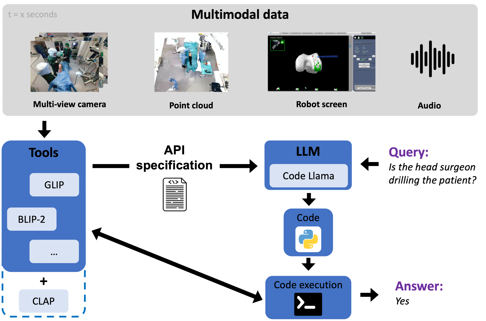
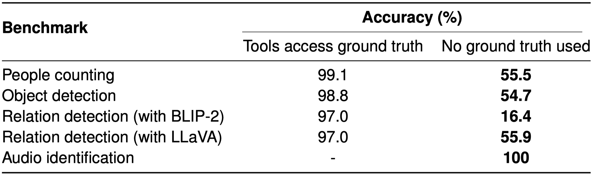

# Exploring Large Language Models for Scene Understanding in the Multimodal Operating Room (Master Thesis)

## Overview
This project implements a framework for scene understanding in the operating room (OR) using multimodal data. The framework leverages a large language model (LLM) that processes input queries and dynamically generates code to instruct various models, i.e. tools, for visual and audio data processing. By using tool interfaces, the LLM integrates pre-trained and open-source models without the need for additional training. This modular approach allows for easy integration of new models, providing flexibility and scalability. It also allows the straightforward integration of additional data modalities. The framework is evaluated on various devised benchmarks, using an in-house multimodal dataset from the operating room, testing basic scene understanding capabilities like object detection and relation detection. Evaluation on these benchmarks shows the ability of the LLM to generating correct code robustly given a problem query. It also identifies the tools as the current bottleneck of the framework, highlighting the need for specialized models in the OR domain to achieve optimal results.

The [full thesis](docs/Master_Thesis__Exploring_Large_Language_Models_for_Scene_Understanding_in_the_Multimodal_Operating_Room.pdf) can be found in the `docs/` folder.





## Setup
### Clone repo
Clone recursively:
```bash
git clone --recurse-submodules https://github.com/eliaswohlgemuth/ORSU.git ORSU
```

### Conda env
**Note:** This environment requires CUDA 11.8 to work correctly with PyTorch. Ensure this CUDA version on your system or use another pytorch installation compatible with your CUDA version.

All steps for setting up this project's conda env are contained in a bash script. Run it from the projects home directory:
```bash
cd ORSU
bash setup_env.sh
```

### Download pretrained models

Download GLIP and X-VLM, which are used by the framework as tools with
```bash
bash download_models.sh  # This may take a while. Make sure the orsu environment is active
```

To download quantized LLMs used through the exllamav2 package go to https://huggingface.co/turboderp and select a model. For every LLM, create a subfolder in ./pretrained_models. The following command downloads the standard Codellama-13B-instruct-4.0bpw to a previously created folder:
```bash
huggingface-cli download turboderp/CodeLlama-13B-instruct-exl2 --revision 4.0bpw --local-dir ./pretrained_models/CodeLlama-13B-it/4.0bpw/ --local-dir-use-symlinks False
```

### Dataset
This project uses an in-house dataset, which is unreleased at the time of this project. The dataset provides recordings of knee replacement surgeries performed by real medical personell on a medical training doll. It consists of multi-view 2D images and 3D point-cloud data of the operating room, an assistive robot screen recording, and audio data. Multiple benchmarks were created using a single view image, the robot screen and audio data from that dataset. The benchmarks test the framework performance in the operating room domain. These benchmarks test basic scene understanding tasks, serving as a first framework evaluation and laying the foundation for more advanced benchmarks in the future.


## Running the code
### Demo run
Run the notebook `demo.ipynb` using the previously set up conda env. It contains four query examples and visualizes the return values of every code line when executed, giving insights into tool behavior and how the execution is arriving at the final code output. 

The notebook uses parameters set in `or-multimodal.yaml` in the folder `configs/`. It specifies the used LLM for code generation and the active models for data processing, among others. Set
```yaml
ground_truth:
    find: True
    relation: True
```
to use ground truth information from a semantically segmented query image and the annotated scene graph of the query image, allowing comparison between the framework's tools performance and ground truth. Setting `find: True` will extract object locations from the segmented image instead of using the framework's object detection model (GLIP). Setting `relation: True` uses the scene graph to extract the correct relation between two objects instead of the framework's model for relation identification (LLaVA).

### Full run (benchmarking)
A full run of one of the benchmarks is performed by running `main_batch.py` in the previously set up conda env. Until publication of the used dataset this is currently not practical due to lack of the necessary data.

### System requirements
The framework requires loading both the code generation LLM and all of the data processing models into GPU memory at the beginning of a run. The required VRAM therefore depends on the chosen model configuration. The setup using the default quantized Codellama-13B-instruct and running the audio identification benchmark, requiring the most models among all benchmarks, requires about 43GB of VRAM, fitting on one Nvidia A40 GPU (46GB).


### Chain-of-thought
Chain-of-Thought prompting is a powerful prompting strategy proposed by Wei et al. (https://arxiv.org/abs/2201.11903). This strategy is combined with knowledge integration, were the LLM is passed additional knowledge to consider when devising a code solution. It is an experimental feature of this framework and meant as an outlook. It showed promising results both on devising a correct solution appraoch and integrating provided knowledge from `knowledge.prompt`, especially when using Llama-3-8B as code generation model. The queries for testing are more advanced than those from the benchmarks and the LLM has not seen examples of them. To use it, update the following parameters in `or-multimodal.yaml`:
```yaml
dataset:
    source_csv: queries_chain_of_thought.csv

codex:
    model_name: 'Llama-3-8B-it-exl2/4.0bpw/'
    prompt : ./prompts/OR-multimodal_cot+knowledge.prompt
    add_knowledge: True

execute_code: False
```
The queries aim at testing the LLM's code solutions and not the final code execution result, which is why code execution is deactivated.

## Acknowledgements

This project is based on the [viper repository](https://github.com/cvlab-columbia/viper) by the Computer Vision Lab at Columbia University, which is the code to the paper [ViperGPT: Visual Inference via Python Execution for Reasoning](https://arxiv.org/abs/2303.08128). Viper provided an essential foundation upon which this work was developed. The original work is licensed under the [Creative Commons Attribution-NonCommercial 4.0 International Public License](https://creativecommons.org/licenses/by-nc/4.0/).